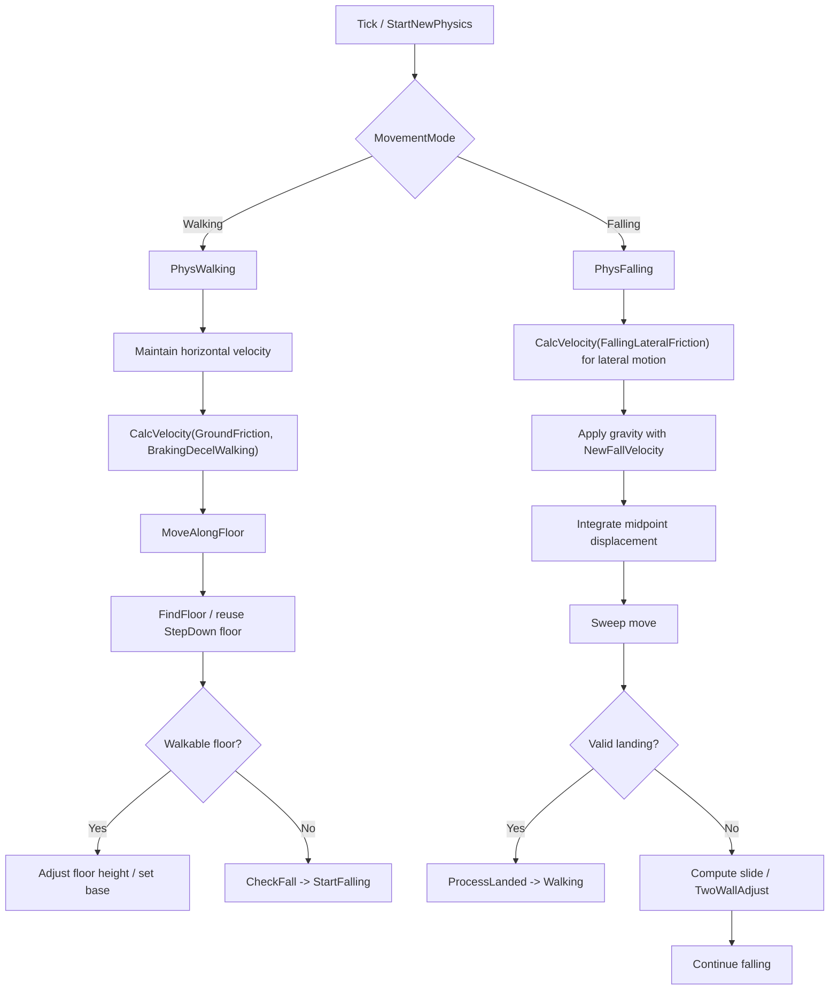
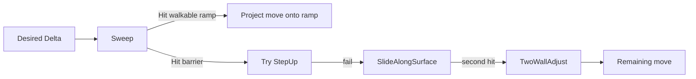
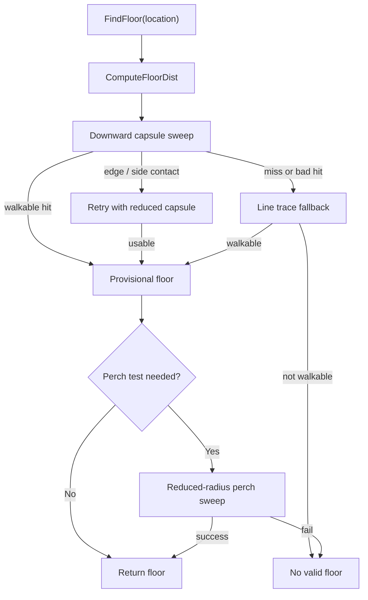
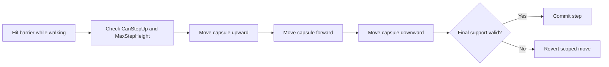

# Unreal `CharacterMovementComponent` Locomotion Analysis

Scope: root `CharacterMovementComponent.cpp/.h` snapshot in this repo.

Included systems:
- `PhysWalking`
- `PhysFalling`
- `CalcVelocity`
- `MoveAlongFloor`
- `SlideAlongSurface`
- `StepUp`
- `FindFloor`

Excluded:
- networking / replication
- navmesh walking
- root motion as a gameplay system
- AI/path following as a feature set

This document describes the core locomotion model Unreal uses for a capsule-driven character. The design is not a rigid-body solver. It is a kinematic sweep solver that:

1. Computes a desired velocity.
2. Converts velocity into a displacement for a sub-step.
3. Sweeps the capsule.
4. Resolves impact by slide, step, or mode switch.
5. Rebuilds floor state and derives the final velocity from actual displacement.

---

## 1. Locomotion Architecture

### 1.1 High-level model

`CharacterMovementComponent` is organized around movement modes. For core locomotion, the relevant modes are:

- Walking: `PhysWalking`
- Falling: `PhysFalling`

Both modes run a sub-stepped simulation loop. Each iteration:

1. Chooses a small `timeTick`.
2. Restores pre-additive state if needed.
3. Updates velocity through `CalcVelocity` plus gravity when relevant.
4. Converts velocity to movement delta.
5. Sweeps the capsule with `SafeMoveUpdatedComponent`.
6. Resolves blocking hits through floor motion, slide, step, or landing.
7. Updates floor state and recomputes velocity from actual motion when appropriate.

### 1.2 Control flow



### 1.3 Architectural intent

The walking path is floor-constrained and tries to preserve a stable ground relationship. The falling path is unconstrained ballistic motion with collision deflection and landing tests. Shared helper functions are used to keep those modes coherent:

- `CalcVelocity`: input acceleration, frictional turning, braking, max-speed clamping.
- `SlideAlongSurface`: impact deflection with walking-specific normal filtering.
- `StepUp`: discrete stair and curb traversal.
- `FindFloor`: authoritative ground query after movement.

---

## 2. Collision Resolution Model

### 2.1 Core collision strategy

The locomotion system is capsule-sweep based, not impulse based. Every move is an attempted swept translation. Collision resolution is hierarchical:

1. Try direct move.
2. If blocked on ground, prefer ramp motion or `StepUp`.
3. Otherwise deflect with `SlideAlongSurface`.
4. If another wall is encountered, use `TwoWallAdjust`.
5. If walkable ground is found during falling, convert to landing.

### 2.2 Why this is stable

The stability comes from three choices:

- Movement is broken into substeps.
- Floor information is explicitly cached and refreshed.
- Final velocity is often reconstructed from actual displacement instead of trusting the intended velocity.

That last point matters: walking can alter the path with ramps, slides, and stepping. After the move, velocity is recomputed from `(NewLocation - OldLocation) / dt`, then projected back onto the floor plane.

### 2.3 Walking-specific surface filtering

`SlideAlongSurface` is specialized for ground locomotion:

- If the hit normal points upward but the surface is not walkable, the normal is flattened into the gravity-plane, so the character is not pushed up a steep slope.
- If the hit normal points downward while already very near the floor, the solver avoids pushing the capsule down into the floor.

This means the walking solver treats steep slopes like walls and treats the floor as a protected constraint surface.

### 2.4 Two-wall behavior

When a second blocking plane is encountered, `TwoWallAdjust` modifies the slide result:

- On ground, upward redirection is allowed only for walkable surfaces.
- The upward component is clamped so it cannot exceed `MaxStepHeight`.
- Otherwise the result is flattened to avoid artificial vertical boosts.



---

## 3. Velocity Integration

### 3.1 `CalcVelocity` responsibilities

`CalcVelocity(DeltaTime, Friction, bFluid, BrakingDeceleration)` is the generic velocity update for non-root-motion movement. It does four things:

1. Determines speed limits from mode and analog input.
2. Applies braking when there is no acceleration or speed exceeds the cap.
3. Applies frictional turning when acceleration exists.
4. Integrates acceleration and clamps back to allowed speed.

### 3.2 Turning model

When acceleration exists, Unreal does not simply add acceleration and let the vector drift. It first rotates the current velocity toward acceleration direction using friction:

```text
Velocity = Velocity - (Velocity - AccelDir * |Velocity|) * clamp(dt * Friction, 0, 1)
```

Interpretation:

- keep current speed magnitude
- rotate direction toward input
- make higher friction produce faster directional convergence

This is why `GroundFriction` affects responsiveness, not just stopping distance.

### 3.3 Acceleration integration

After the direction adjustment:

```text
Velocity += Acceleration * dt
Velocity = ClampMagnitude(Velocity, MaxInputSpeed)
```

Walking and falling both use this, but falling first projects the acceleration into the lateral plane, then applies gravity separately.

### 3.4 Falling integration

`PhysFalling` splits velocity update into two layers:

- Lateral layer: `CalcVelocity` with `FallingLateralFriction`
- Vertical layer: `NewFallVelocity` adds gravity and clamps terminal velocity

Position is then integrated with midpoint integration:

```text
Adjusted = 0.5 * (OldVelocity + NewVelocity) * dt
```

This is more accurate than forward Euler and is one reason Unreal jump arcs are relatively stable across frame rates. There is also a dedicated apex substep path to land exactly on the jump apex when the vertical sign changes within a substep.

### 3.5 Walking integration

Walking does not directly use midpoint integration for movement. Instead:

1. `CalcVelocity` updates `Velocity`.
2. `MoveAlongFloor` converts velocity into floor-constrained displacement.
3. After collision resolution and floor adjustment, velocity is reconstructed from actual displacement.

That makes walking effectively a constrained kinematic solve, not free integration.

### 3.6 Pseudo-code

```text
function CalcVelocity(dt, friction, brakingDecel):
    if invalid or tiny dt:
        return

    maxAccel = GetMaxAcceleration()
    maxSpeed = GetMaxSpeed()

    requestedAccel, requestedSpeed = ApplyRequestedMove(...)

    maxInputSpeed = max(maxSpeed * AnalogInputModifier, MinAnalogSpeed)
    maxSpeed = max(requestedSpeed, maxInputSpeed)

    zeroAccel = Acceleration == 0
    overMax = |Velocity| > maxSpeed

    if (zeroAccel and requestedAccel == 0) or overMax:
        brakingFriction = bUseSeparateBrakingFriction ? BrakingFriction : friction
        ApplyVelocityBraking(dt, brakingFriction, brakingDecel)
        if overMax and |Velocity| fell below maxSpeed while input points forward:
            Velocity = normalize(OldVelocity) * maxSpeed
    else:
        Velocity = turn_toward_acceleration_using_friction(Velocity, Acceleration, friction, dt)

    if bFluid:
        Velocity *= (1 - min(friction * dt, 1))

    if Acceleration != 0:
        Velocity += Acceleration * dt
        Velocity = clamp(|Velocity|, maxInputSpeed)

    if requestedAccel != 0:
        Velocity += requestedAccel * dt
        Velocity = clamp(|Velocity|, requestedSpeed)
```

---

## 4. Ground Detection

### 4.1 `FindFloor` is the authoritative ground query

Ground state is stored in `CurrentFloor` and refreshed through `FindFloor`. The function decides whether the character has:

- a blocking hit below
- a walkable floor
- the exact floor distance
- a line-trace fallback result
- a perchable edge case

### 4.2 Floor query structure

`FindFloor` delegates the actual trace work to `ComputeFloorDist`.

`ComputeFloorDist`:

1. Optionally reuses a supplied downward sweep if it is vertical and valid.
2. Sweeps a slightly shrunken capsule downward.
3. Rejects edge-adjacent hits.
4. If needed, re-sweeps with smaller radius / altered shrink to avoid side contacts.
5. If sweep is inconclusive, performs a line trace.
6. Marks the result walkable only if `IsWalkable(hit)` succeeds.

### 4.3 Important design detail: shrunken sweep

The floor sweep shrinks the capsule height for the query. That avoids floor checks immediately re-hitting the surface the character is already resting on and allows slight penetration recovery. It is a deliberate robustness hack, not a physical model.

### 4.4 Perching

After a valid downward hit, `FindFloor` may do a perch test:

- if the hit is near the capsule edge
- and `PerchRadiusThreshold` allows it
- and a reduced-radius floor test succeeds

then the character is allowed to stand near a ledge edge even if the full capsule would not have centered over a walkable patch.

`PerchAdditionalHeight` extends how far above the lower walkable surface a perched state may be tolerated.

### 4.5 Caching behavior

`FindFloor` does not always resweep. It can reuse `CurrentFloor` unless:

- forced by `bAlwaysCheckFloor`
- forced by teleport / penetration / dynamic base changes
- caller disallows cache

This is important for performance, but the walking loop still refreshes aggressively after meaningful movement.

### 4.6 Ground detection diagram



### 4.7 Pseudo-code

```text
function FindFloor(location):
    if collision disabled:
        clear floor
        return

    sweepDist = max(MAX_FLOOR_DIST, MaxStepHeight + heightAdjust)
    lineDist = sweepDist

    if mustRecompute:
        floor = ComputeFloorDist(location, lineDist, sweepDist, capsuleRadius)
    else:
        floor = CurrentFloor

    if floor came from a blocking sweep:
        if hit is near edge and perch is enabled:
            perchFloor = ComputePerchResult(reducedRadius, ...)
            if perchFloor valid:
                merge/override floor
            else if floor was not safely walkable:
                mark no walkable floor
```

---

## 5. StepUp Algorithm

### 5.1 Purpose

`StepUp` handles discrete obstacle traversal: stairs, curbs, and small ledges. It is only attempted when the hit object and surface allow stepping.

### 5.2 Preconditions

`StepUp` immediately rejects if:

- `CanStepUp(hit)` is false
- `MaxStepHeight <= 0`
- the impact point is too high on the capsule
- gravity direction is invalid
- the impact is below the effective floor base

The algorithm also adjusts its effective upward allowance using the current floor distance, because the character often hovers slightly above the floor rather than touching it exactly.

### 5.3 Three-phase move

The algorithm is a transaction wrapped in `FScopedCapsuleMovementUpdate`:

1. Move up by `StepTravelUpHeight`
2. Move forward by remaining delta
3. Move down by `StepTravelDownHeight`

If any important check fails, the whole sequence is reverted.

### 5.4 Validation rules

After the step-down sweep, Unreal rejects the step if:

- resulting vertical rise exceeds `MaxStepHeight`
- landing surface is unwalkable and opposes motion
- the hit is outside edge tolerance
- stepping higher would land on a surface that itself cannot be stepped on
- floor validation after the step indicates a bad perch / invalid support case

### 5.5 Why this works

The step logic treats steps as a topological problem rather than a continuous slide problem. Instead of hoping a slide can climb a stair, it explicitly lifts the capsule, advances it, and settles it back down. That avoids the common “stair jitter” seen in pure slide solvers.

### 5.6 Diagram



### 5.7 Pseudo-code

```text
function StepUp(gravityDir, delta, hit):
    if cannot step:
        return false

    save old location and floor-relative heights
    begin scoped movement

    if move_up(MaxStepHeight adjusted for floor hover) starts penetrating:
        revert
        return false

    forwardHit = move_forward(delta)
    if forwardHit blocks:
        handle impact
        slide remaining forward motion
        if no useful progress:
            revert
            return false

    downHit = move_down(stepDownHeight)
    if downHit starts penetrating:
        revert
        return false

    if downHit blocks:
        if resulting step height > MaxStepHeight:
            revert
            return false
        if support is invalid, unwalkable, or outside edge tolerance:
            revert
            return false
        optionally FindFloor() and cache step-down floor result

    commit
    mark bJustTeleported when horizontal-only velocity should be preserved
    return true
```

---

## 6. Sliding Algorithm

### 6.1 Core sliding behavior

Sliding is built from the usual vector projection approach:

- remove movement into the collision normal
- keep tangential motion
- move for the remaining fraction of the timestep

The generic computation comes from `Super::SlideAlongSurface` / `ComputeSlideVector`, but `CharacterMovementComponent` changes the inputs and postprocessing.

### 6.2 Walking slide rules

For walking:

- walkable ramps can redirect motion upward
- unwalkable upward normals are flattened so they behave like walls
- downward push into the floor is filtered out when already close to the floor

This preserves the walking constraint: move tangentially along valid support, never climb steep walls, never drill down through the current floor.

### 6.3 Falling slide rules

For falling:

- `ComputeSlideVector` calls `HandleSlopeBoosting`
- if the slide would create more upward motion than the original move intended, the upward component is clamped or removed

This prevents wall impacts from converting downward or horizontal motion into unrealistic upward boosts.

### 6.4 Two-wall resolution

After a second impact:

- `TwoWallAdjust` combines the old and new normals
- on ground it only permits upward redirection on walkable geometry
- excessive upward result is clamped to `MaxStepHeight`

### 6.5 Sliding pseudo-code

```text
function SlideAlongSurface(delta, remainingTime, normal, hit):
    if walking:
        if normal points upward and hit not walkable:
            normal = flatten_to_floor_plane(normal)
        else if normal points downward and current floor is very near:
            normal = flatten_or_replace_with_floor_normal(normal)

    slideDelta = project_delta_onto_contact_plane(delta, normal)

    if falling:
        slideDelta = HandleSlopeBoosting(slideDelta, delta, remainingTime, normal, hit)

    move(slideDelta)
```

### 6.6 Mental model

Walking slide:
- “stay glued to legal support”

Falling slide:
- “deflect, but never gain fake height”

That distinction is one of the most important differences between the two locomotion modes.

---

## 7. Braking and Friction Model

### 7.1 Two separate concepts

Unreal’s locomotion uses friction in two different ways:

1. Turning friction: helps velocity rotate toward input direction.
2. Braking friction: creates drag when input is absent or speed exceeds the limit.

It also uses a separate constant deceleration term during braking.

### 7.2 Braking equation

`ApplyVelocityBraking` applies:

```text
Velocity = Velocity + ((-Friction) * Velocity + RevAccel) * dt
```

where:

- `-Friction * Velocity` is velocity-proportional drag
- `RevAccel = -BrakingDeceleration * normalize(Velocity)` is constant opposing deceleration

This is a hybrid drag + constant decel model.

### 7.3 Substepped braking

Braking is internally substepped using `BrakingSubStepTime`, clamped to roughly `1/75` to `1/20` seconds. That reduces low-framerate error. Without this, large frame times would make drag-based deceleration much less stable.

### 7.4 Parameter relationships

- `GroundFriction`
  - walking turn responsiveness
  - braking friction too, if separate braking friction is disabled
- `FallingLateralFriction`
  - same role, but for falling lateral control
- `BrakingFrictionFactor`
  - scales whichever friction is active during braking
  - comment notes `2` is the historical default, `1` is the “true drag equation”
- `BrakingFriction`
  - optional explicit braking friction if `bUseSeparateBrakingFriction` is true
- `BrakingDecelerationWalking`
  - constant deceleration used for walking stop behavior

### 7.5 Practical interpretation

High `GroundFriction`:
- faster turning
- usually faster stopping too unless braking friction is separated

High `BrakingDecelerationWalking`:
- stronger stop force independent of current speed

High `BrakingFriction`:
- stronger speed-proportional drag when braking

This separation lets Unreal tune “responsive steering” and “stop distance” somewhat independently.

### 7.6 Pseudo-code

```text
function ApplyVelocityBraking(dt, friction, brakingDecel):
    friction *= max(BrakingFrictionFactor, 0)
    brakingDecel = max(brakingDecel, 0)

    reverseAccel = -normalize(Velocity) * brakingDecel
    remaining = dt

    while remaining >= MIN_TICK_TIME:
        subDt = choose_substep(remaining, BrakingSubStepTime, friction)
        remaining -= subDt

        Velocity += ((-friction) * Velocity + reverseAccel) * subDt

        if dot(Velocity, OldVelocity) <= 0:
            Velocity = 0
            return

    if |Velocity| is tiny or below brake-to-stop threshold:
        Velocity = 0
```

---

## 8. Mode-by-Mode Summary

### 8.1 Walking

- Velocity is updated by input, friction, and braking.
- Motion is projected onto the floor through `MoveAlongFloor`.
- Barriers are resolved by `StepUp` first, then slide.
- Floor is revalidated every iteration.
- Final velocity is reconstructed from actual displacement.

### 8.2 Falling

- Lateral input is handled by `CalcVelocity`.
- Gravity is applied separately through `NewFallVelocity`.
- Position uses midpoint integration.
- Hits are resolved by deflection and two-wall sliding.
- Landing is tested with `IsValidLandingSpot` and `FindFloor`.

---

## 9. Key Engineering Takeaways

1. The locomotion system is kinematic and query-driven, not physically simulated.
2. Walking is fundamentally a floor-constrained solve layered on top of a generic sweep/slide engine.
3. `StepUp` is discrete and transactional; stairs are handled as explicit topology changes, not just slope motion.
4. `FindFloor` is central to stability. Many apparent movement behaviors are really floor-query behaviors.
5. Friction is overloaded intentionally: it controls both turning response and, unless separated, braking drag.
6. Falling uses a cleaner integrator than walking because walking is dominated by support constraints and collision projection.
7. Much of the “feel” of Unreal locomotion comes from anti-artifact filters:
   - flattening unwalkable normals while walking
   - edge tolerance rejection
   - perch logic
   - slope boost suppression while falling
   - braking substepping

---

## 10. Minimal Reference Map

Primary functions in the repo snapshot:

- `CalcVelocity`
- `ApplyVelocityBraking`
- `PhysWalking`
- `MoveAlongFloor`
- `PhysFalling`
- `SlideAlongSurface`
- `TwoWallAdjust`
- `ComputeGroundMovementDelta`
- `ComputeFloorDist`
- `FindFloor`
- `StepUp`

If you want the next pass, the most useful extension would be a second document that traces one concrete scenario end-to-end:

- flat ground -> ramp -> wall -> step -> ledge -> fall -> landing

That would turn the abstractions above into a frame-by-frame execution trace.
